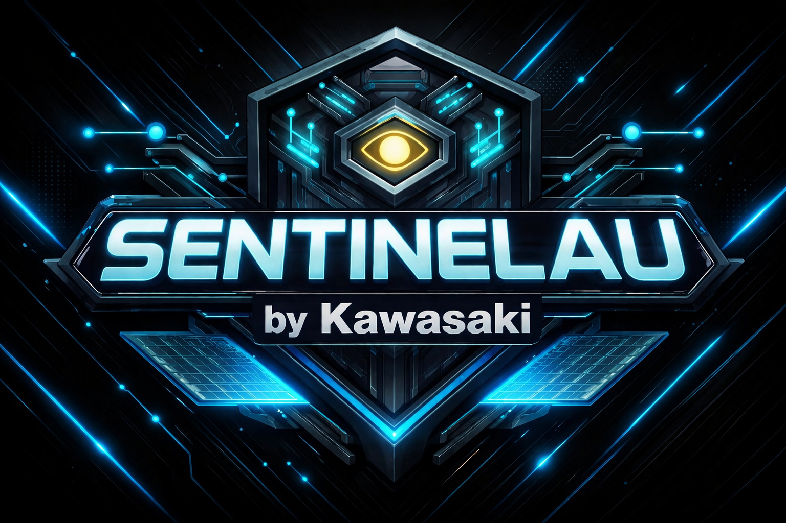

  

<h1 align="center">SentinelAU</h1>

  <b>Control. Protection. Stability.</b>

  
  
  
  

  

  🇷🇺 Russian version: <a href="README.md">README.md</a>

---

<b>🔰 SentinelAU</b> — an anti-cheat mod for <b>Among Us</b>, designed to protect lobbies, expand host capabilities, and provide a more convenient and stable gameplay experience.

---

## 📌 Project Status

SentinelAU is currently in active development.

Current priorities:
- expanding protection systems
- improving host tools
- refining the interface
- preparing for the first public release

## 🛡️ About

**SentinelAU** is a mod for **Among Us** designed to improve lobby protection, host control, and overall game stability.

## ⚙️ Current Features

- protection against current exploits
- a protection system that drops cheater attacks outside the host, currently not yet fully implemented
- auto-host functionality through the mod menu
- banlist and whitelist viewing and editing through the mod menu
- nickname-based banning
- color locking by friend code through a file
- a licensing system requiring an activation key after installation, without which the anti-cheat will not function
- custom design and visual style
- and much more

## 🚀 Plans

Further expansion and development of the mod's functionality is planned.

**Estimated release window:** Summer-Autumn 2026.

## ℹ️ About This Repository

This GitHub repository serves as the official public page for **SentinelAU**.

It contains general information about the mod, its current features, visual materials, development status, and other public project-related information.

The full source code is not published and is not planned to be made public.

<h2 align="center">📢 Project News</h2>

  Telegram is the official platform for <b>SentinelAU</b>, where news, announcements, updates, and other project-related materials are published.

  <b>The future release of SentinelAU will also be published through the Telegram channel.</b>

  

---

## ⚠️ Disclaimer

> This mod is not affiliated with Among Us or Innersloth LLC, and the content contained therein is not endorsed or otherwise sponsored by Innersloth LLC. Portions of the materials contained herein are property of Innersloth LLC. © Innersloth LLC.

## 🚨 Important

> ⚠️ SentinelAU is a fan-made mod for Among Us.  
> ⚠️ It is not official, licensed, or endorsed by Innersloth LLC.  
> ⚠️ A legitimate copy of Among Us is required.  
> ⚠️ This repository and its releases do not include the base game files.
